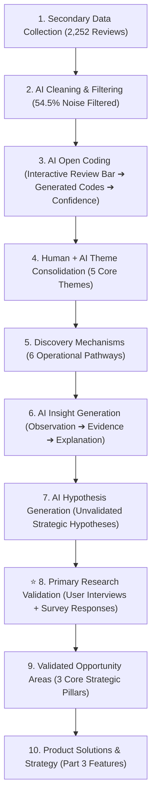

# AI-Powered Discovery Engine: 10-Step Product Discovery Workflow

> **Project:** AI-Powered Discovery Engine for Habit-Driven Blinkit Shoppers  
> **Objective:** Demonstrate a 10-step product discovery research methodology incorporating secondary dataset extraction, AI open coding, primary research validation (Survey Responses + User Interviews), and concrete product solutions.  
> **Strategic Goal:** Increase Monthly Active Customers purchasing from at least one new category every month.

---

## 🌟 Live Interactive Workflow Demonstration

- **Local Preview:** `http://localhost:3000` or `http://localhost:8000`
- **Public Deployment Plan:** Railway (Backend) + Vercel (Frontend)

---

## 🚀 The 10-Step Product Discovery Methodology

### Stage 1: Multi-Channel Ingestion Feed
Ingests 2,252 customer reviews across 5 public data sources (`blinkit_reviews_2000.json`, `mouthshut_reviews.json`, `blinkit_scrape_2.json`, `blinkit_scrape_1.json`, `reddit_reviews.json`).

### Stage 2: PII Redaction & Filtering Pipeline
Filters out 1,228 operational noise reviews (54.5% late delivery/support chats) to retain 1,024 research-relevant reviews (45.5%).

### Stage 3: AI Open Coding (Interactive Review Bar + Analyze Button)
Allows users to type/paste any custom customer review (or select sample prompts) and click **Analyze Review** to run real-time qualitative AI Open Coding:
* **User Input Review:** *"I always order the exact same vegetables every week and never explore other categories."*
* **Generated Codes:** `Habit shopping`, `Routine purchase`, `Repeat basket`, `Low exploration`
* **Confidence Score:** 96%
* **AI Reasoning:** User explicitly describes repetitive purchasing behavior of staple items without exploring non-grocery categories.

### Stage 4: Thematic Clustering
Aggregates open codes into 5 core research themes:
1. **Authenticity & Risk Perception** (143 mentions | 26.2%)
2. **Habit-Driven Utility Shopping** (137 mentions | 25.1%)
3. **Experiential Micro-Sampling & Trial** (115 mentions | 21.1%)
4. **Late-Night Emergency Urgency** (92 mentions | 16.9%)
5. **Deals & Cart Threshold Nudges** (58 mentions | 10.6%)

### Stage 5: Discovery Pathways Map (HOW Users Discover)
Tracks the 6 operational channels through which users discover new categories:
1. **Targeted Search & Direct Navigation** (143 mentions)
2. **Emergency Panic & Situational Urgency** (92 mentions)
3. **Cart Threshold Nudges & Gap Fillers** (58 mentions)
4. **Brand-Led PDP Seals & Verification** (143 mentions)
5. **Trial Sampling & Experiential Discovery** (115 mentions)
6. **Seasonality & Environmental Triggers** (58 mentions)

### Stage 6: AI Insight Generation
Outputs PM strategic product opportunities (e.g., *"Introducing contextual discovery moments within habitual reorder journeys may increase cross-category exploration"*).

### Stage 7: AI Hypothesis Generation
Formulates testable hypotheses linking insights to measurable metrics (e.g., *"IF we introduce non-grocery recommendations at cart review during staple reorders, THEN cross-category basket adoption will significantly increase"*).

---

## ⚡ Production Deployment Topology

For detailed step-by-step instructions, environment variable schemas, and database setup, see **[deployment.md](file:///c:/Graduation%20Project/deployment.md)**.

* **Frontend Dashboard (Vercel):** Deployed on Vercel Global Edge Network (`https://blinkit-discovery-engine.vercel.app`).
* **Backend Services (Railway):** FastAPI, PostgreSQL with `pgvector`, Redis queues (`https://blinkit-backend-production.up.railway.app`).

