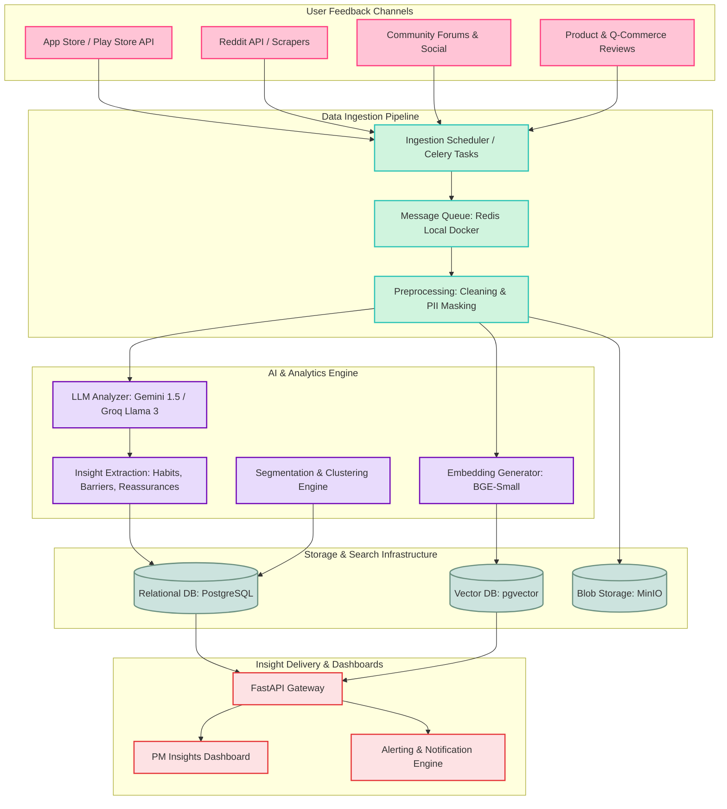
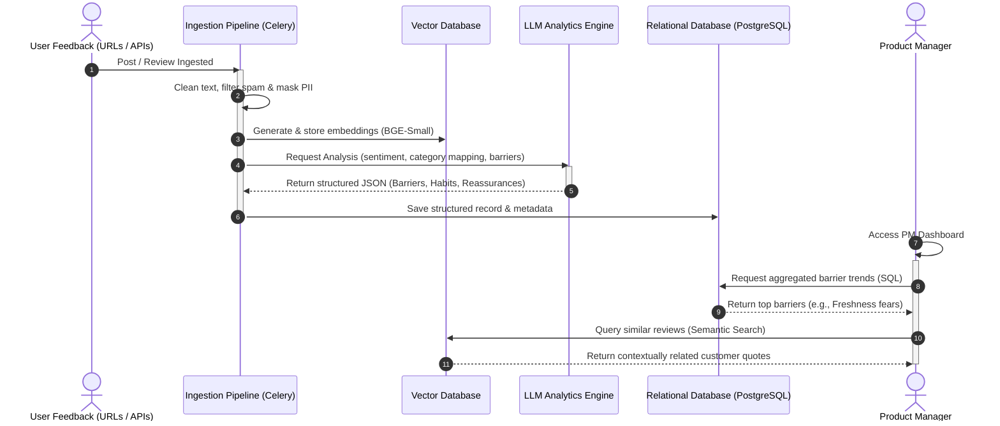

# Architecture Design: AI-Powered Discovery Engine for Habit-Driven Blinkit Shoppers

This document outlines the architecture for the **AI-Powered Discovery Engine**, designed to ingest user feedback at scale, extract actionable insights about consumer habits and barriers, and support Blinkit’s strategic goal: **increasing the percentage of Monthly Active Customers purchasing from new categories.**

---

## 1. System Architecture Overview

The system uses a modern, modular data pipeline to ingest unstructured feedback from various channels, clean and preprocess the text, analyze it using LLM and Embedding models, and store the structured data for querying and visualization.

---

## 2. Detailed Component Breakdown

### 2.1 Ingestion & Preprocessing Pipeline
* **Data Collectors:** Scheduled tasks (using Celery/Airflow) ingest data from user-provided URLs, feed endpoints, or official public APIs.
* **Queue System:** Ingested raw feedback is pushed to a **Local Redis Docker Container** serving as a message broker to decouple ingestion rate from downstream processing limits.
* **PII Masking & Cleaning:** A preprocessing step filters spam, handles HTML/markdown formatting, and strips personally identifiable information (PII) before storage or LLM processing.

### 2.2 Storage Architecture
* **Raw Blob Storage (MinIO):** Archives raw JSON payloads locally for historical reprocessing or audit trails using self-hosted MinIO (S3-compatible object storage).
* **Relational Database (PostgreSQL):** Stores structured metadata (user segment, category labels, timestamps, sentiment scores, and extracted barriers/habits).
* **Vector Database (pgvector):** Stores semantic embeddings of reviews within PostgreSQL to power similarity search, semantic clustering, and contextual RAG queries. Using pgvector keeps the storage and vector engine unified and free.

### 2.3 AI & Analytics Engine
* **Embedding Model (BGE-Small):** Generates vector representations of cleaned text locally (free of cost) using HuggingFace's `sentence-transformers` library.
* **LLM Analysis Agent (e.g., Gemini 1.5 Pro/Flash via Google AI Studio Free Tier or Groq API Llama models):** Analyzes unstructured feedback to perform:
  * **Categorization:** Maps mentions to specific product categories (e.g., Fresh Produce, Snacks, Staples).
  * **Sentiment & Emotion Analysis:** Scores frustration level, delight, or neutral habit indicators.
  * **Insight Extraction:** Automatically tags and parses text into categories defined in the [problemstatement.md](file:///c:/Graduation%20Project/problemstatement.md):
    * *Barriers:* e.g., "Trust issues with fresh produce weight/freshness."
    * *Habits:* e.g., "Always buys milk and bread every morning mechanically."
    * *Trust Signals:* e.g., "Needs expiry date visible on UI."
* **Segmentation Engine:** Combines user metadata and behavioral clusters to categorize users (e.g., "Habit-Driven Shopper", "Experimental Deal-Hunter").

### 2.4 API & Dashboards
* **FastAPI Backend:** Exposes secure REST endpoints to retrieve processed feedback, aggregated metrics, and execute semantic searches.
* **Insights Dashboard (React / Tailwind CSS):** A dedicated interface for PMs, displaying:
  * Heatmaps showing which categories face the highest exploration barriers.
  * Sentiment trends over time.
  * Live alert streams showing new user frustrations or unmet needs.

---

## 3. Data Flow & Processing Sequence

This sequence diagram outlines the lifecycle of a single piece of user feedback (e.g., a Reddit comment detailing frustration about ordering fruits) as it propagates through the system:

---

## 4. Scalability & Cost Management

* **Rate Limiting & Batching:** Downstream LLM API calls are throttled and batched to prevent rate limit exceptions and manage processing costs.
* **Vector Index Optimization:** Uses HNSW indexing in pgvector/Pinecone for ultra-fast, sub-10ms semantic search queries.
* **Data Retention Policies:** Raw data in PostgreSQL is aggregated monthly, and older granular records are offloaded to cold storage (e.g., S3 Glacier) to manage storage costs.

---

## 5. Security & Privacy Compliance

* **PII Redaction:** A localized regex/NLP-based engine (such as Microsoft Presidio) strips names, phone numbers, addresses, and email IDs prior to sending data to public LLM endpoints.
* **Role-Based Access Control (RBAC):** Restricts dashboard access to authorized product managers and developers.
