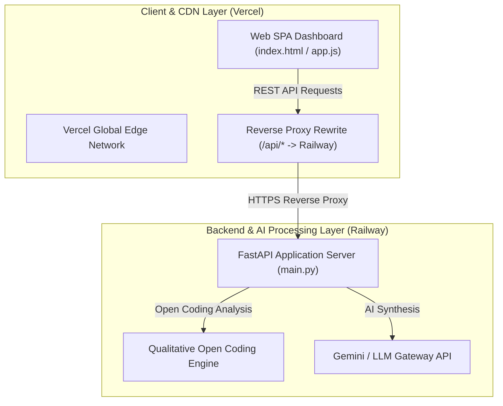

# Production Deployment Guide: AI-Powered Discovery Engine

This document provides step-by-step instructions for deploying the **Blinkit AI Discovery Engine** across a decoupled infrastructure:
- **Backend API Gateway**: Deployed on **Railway** (`main.py` via FastAPI & Uvicorn).
- **Frontend SPA**: Deployed on **Vercel** (Global CDN with `/api/*` reverse proxy rewrites).

---

## 1. System Deployment Architecture & Topology



---

## 2. Project Deployment Configuration Files

The repository includes pre-configured deployment manifests:

| File | Purpose | Hosting Target |
| :--- | :--- | :--- |
| `main.py` | FastAPI application endpoints (`/health`, `/api/analyze-review`, `/api/insights`) | Railway |
| `requirements.txt` | Python dependencies (`fastapi`, `uvicorn`, `pydantic`, `python-dotenv`) | Railway |
| `Procfile` | Startup process command (`web: uvicorn main:app --host 0.0.0.0 --port $PORT`) | Railway |
| `railway.json` | Nixpacks build and health check configuration (`/health`) | Railway |
| `vercel.json` | Vercel SPA routing and `/api/*` reverse proxy to Railway backend | Vercel |

---

## 3. Step-by-Step Deployment Instructions

### Phase 1: Deploy Backend to Railway

1. **Log in to Railway**:
   - Go to [Railway.app](https://railway.app) and log in with your GitHub account.

2. **Create New Railway Project**:
   - Click **"New Project"** $\rightarrow$ **"Deploy from GitHub repo"**.
   - Select your repository.

3. **Configure Environment Variables**:
   - In your Railway service dashboard, navigate to **Variables** and add:
     ```env
     PORT=8000
     ENVIRONMENT=production
     CORS_ORIGINS=*
     GEMINI_API_KEY=your_optional_gemini_api_key
     ```

4. **Generate Backend Public URL**:
   - Go to **Settings** $\rightarrow$ **Networking** $\rightarrow$ Click **"Generate Domain"**.
   - Note down your Railway backend domain (e.g., `https://blinkit-backend-production.up.railway.app`).

---

### Phase 2: Deploy Frontend to Vercel

1. **Log in to Vercel**:
   - Go to [Vercel.com](https://vercel.com) and log in with GitHub.

2. **Import Project**:
   - Click **"Add New..."** $\rightarrow$ **"Project"**.
   - Import your repository.

3. **Configure Framework & Output**:
   - **Framework Preset**: `Other` / `Static HTML`
   - **Build Command**: Leave empty (or `npm run build` if building bundler)
   - **Output Directory**: `.` (Root directory)

4. **Verify `vercel.json` Proxy Rule**:
   - Update `vercel.json` with your exact Railway backend domain if different from default:
     ```json
     {
       "version": 2,
       "cleanUrls": true,
       "rewrites": [
         {
           "source": "/api/:path*",
           "destination": "https://<your-railway-backend>.up.railway.app/api/:path*"
         }
       ]
     }
     ```

5. **Deploy**:
   - Click **Deploy**. Vercel will instantly publish your site to a global CDN URL (e.g., `https://blinkit-ai-discovery-engine.vercel.app`).

---

## 4. Verification & Health Checks

Once deployed, verify the system components:

1. **Backend Health Check**:
   ```bash
   curl -I https://<your-railway-backend>.up.railway.app/health
   ```
   *Expected Response*: `HTTP/1.1 200 OK`

2. **Frontend End-to-End Test**:
   - Open your live Vercel URL.
   - Navigate to **Stage 3 (AI Open Coding)**.
   - Click any of the recommended sample prompts (e.g. `9-Min Late Night Staples`) and hit **Process Review**.
   - Confirm that qualitative open coding tags and reasoning are generated seamlessly.
