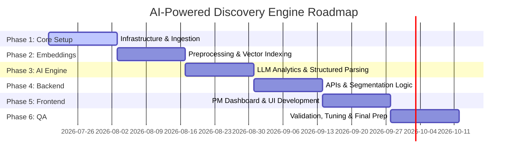

# Phase-Wise Implementation Plan

This document details the step-by-step roadmap to build and deploy the **AI-Powered Discovery Engine**. The timeline is structured into 6 phases across 12 weeks, ensuring a logical progression from infrastructure to user-facing insights.

---

## Roadmap at a Glance

---

## 🛠 Phase 1: Environment Setup & Data Ingestion (Weeks 1-2)
**Goal:** Establish the local developer environment and implement the ingestion adapters.

### Tasks
- [ ] **Docker Environment Setup:** Spin up local Docker containers for:
  - **PostgreSQL** (version 15+ with the `pgvector` extension preinstalled).
  - **MinIO** (configured with default access keys and bucket for feedback blobs).
  - **Redis** (serving as the Celery task broker).
- [ ] **Database Schema Initialization:** Define PostgreSQL schemas for storing metadata (user identifiers, categories, timestamps, metrics) and feedback metrics.
- [ ] **Ingestion Gateway:**
  - Build FastAPI endpoints to accept user-provided URLs, file uploads (CSV/JSON), or payload streams.
  - Implement a basic scheduled runner (Celery/APScheduler) to pull data from target endpoints.
- [ ] **Raw Storage:** Set up the connection layer to upload raw JSON payloads directly into MinIO.

**Deliverable 1:** A Docker Compose stack running PostgreSQL, Redis, and MinIO, with ingestion tasks saving raw JSON payloads to local blob storage.

---

## 🔬 Phase 2: Preprocessing & Vector Indexing (Weeks 3-4)
**Goal:** Clean unstructured feedback and index it semantically for search capability.

### Tasks
- [ ] **Text Preprocessing Pipeline:**
  - Clean HTML, markup, and characters from inputs.
  - Integrate **Microsoft Presidio** with customized regex rules for redacting PII (such as local phone numbers, email addresses, and names).
- [ ] **Local Embedding Engine:**
  - Import the HuggingFace `sentence-transformers` library.
  - Load the **BGE-Small** (BAAI/bge-small-en-v1.5) embedding model locally.
- [ ] **Recursive Text Chunking:**
  - Write text-splitting utility scripts to handle long documents (e.g., forum threads) into chunks of ~400 tokens with a 50-token overlap.
- [ ] **pgvector Indexing:**
  - Write utility scripts to generate embeddings for processed chunks and insert them into the `pgvector` column of the PostgreSQL table.
  - Build an HNSW index on the vector column for rapid similarity searches.

**Deliverable 2:** A pipeline that sanitizes ingested comments, generates vector embeddings locally, and saves them to a searchable `pgvector` database.

---

## 🧠 Phase 3: AI Analytics Engine & Structured Insight Extraction (Weeks 5-6)
**Goal:** Wire up LLM analysis to parse unstructured reviews into structured insights.

### Tasks
- [ ] **LLM Client Wrapper:**
  - Implement adapters for the Google AI Studio SDK (Gemini 1.5 Pro and Gemini 1.5 Flash API).
  - Set up a backup adapter for Groq (Llama 3.1) in case of rate limits.
- [ ] **Structured Parsing Prompts:**
  - Design prompts instructing the LLM to analyze the feedback for:
    - *Sentiment:* Score from -1.0 (strongly negative) to +1.0 (strongly positive).
    - *Habit Indicators:* Flag indicators showing recurring patterns.
    - *Discovery Barriers:* Classify friction points (e.g., trust, price, UI navigation).
    - *Reassurance Needs:* Identify what trust signals are required.
  - Enforce structured outputs by supplying the API with a strict JSON Schema.
- [ ] **Robust Error Handling:**
  - Code retry-loops for transient API errors (HTTP 429/503) with exponential backoff.
  - Write fallback regex parsers to salvage truncated JSON outputs.

**Deliverable 3:** An analytical pipeline that enriches raw database rows with structured insights returned by Gemini/Groq.

---

## ⚡ Phase 4: API Development & Segmentation Logic (Weeks 7-8)
**Goal:** Create backend services and implement user segmentation rules.

### Tasks
- [ ] **Backend Web Framework:**
  - Build out FastAPI routes to expose:
    - `/api/v1/search/semantic`: Performs vector similarity queries against pgvector database using a search string.
    - `/api/v1/insights/metrics`: Aggregated breakdown of barriers, sentiments, and category counts.
    - `/api/v1/feedback/upload`: Ingestion endpoint.
- [ ] **Segmentation Engine:**
  - Develop Python scripts to group users into behavior-based categories based on transactional telemetry or explicit feedback flags (e.g., segmenting "Habit-Driven Shoppers").
- [ ] **Database Queries Tuning:**
  - Optimize SQL queries using indexing, and tune the HNSW parameter `ef_search` to balance query speed with recall.

**Deliverable 4:** A fully functional REST API capable of semantic queries, segment extraction, and aggregation metrics.

---

## 🎨 Phase 5: PM Dashboard UI Development (Weeks 9-10)
**Goal:** Build the visualization dashboard for Product Managers to browse trends.

### Tasks
- [ ] **UI Component Library:**
  - Set up a React project using Vite, styled with Tailwind CSS.
  - Establish a clean, responsive layout featuring dark mode compatibility.
- [ ] **Visualization Widgets:**
  - Design and render charts (e.g., bar charts of top barriers, sentiment curves over time).
  - Implement a category-specific heatmap highlighting discoverability scores.
- [ ] **Semantic Search Interface:**
  - Build an interactive search bar linked to the `/search/semantic` API.
  - Display search results alongside matching text highlights and computed sentiment scores.

**Deliverable 5:** An intuitive React dashboard that displays aggregated analytics and lets users query customer feedback semantically.

---

## 🧪 Phase 6: Validation, Tuning & Final Prep (Weeks 11-12)
**Goal:** Validate analytical accuracy, conduct system testing, and finalize deployment code.

### Tasks
- [ ] **Analytical Accuracy Validation:**
  - Curate a golden evaluation dataset (100 sample feedback entries).
  - Run the feedback through the LLM pipeline and measure classification accuracy (Precision/Recall) of categories and barriers.
  - Fine-tune prompting instructions to correct persistent mapping errors.
- [ ] **Stress & Connection Testing:**
  - Execute simulated high-concurrency ingestion tasks using Locust or Apache Bench to ensure Redis queues and pgvector pool sizes hold up.
- [ ] **Production Deployment Manifests:**
  - Finalize Docker Compose files.
  - Prepare deployment instructions and set environment variable templates (e.g., `gemini_api_key`).

**Deliverable 6:** A production-ready project with validated classification metrics, stress test results, and final setup documentation.
