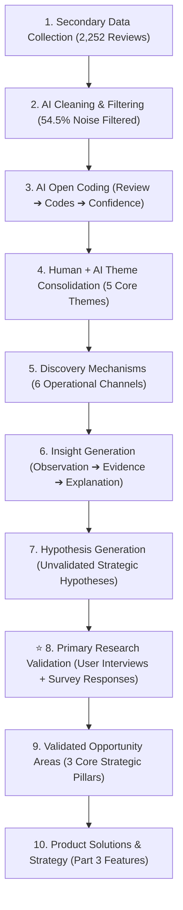
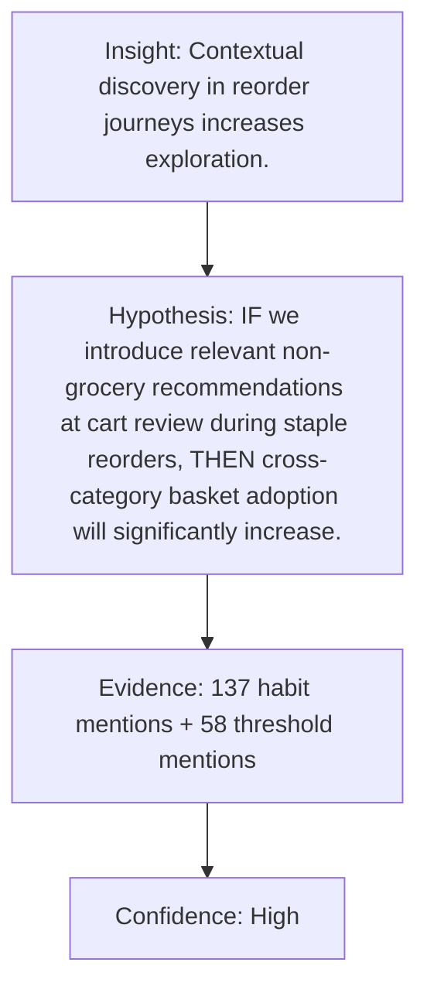
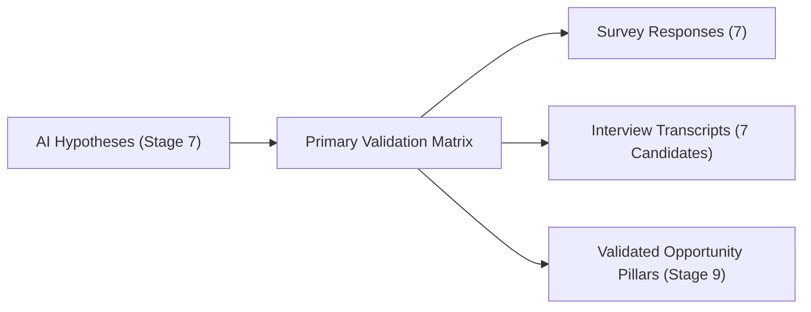

# Comprehensive Insights Report: 10-Step Product Discovery Methodology

> **Project:** AI-Powered Discovery Engine for Habit-Driven Blinkit Shoppers  
> **Strategic Goal:** Increase Monthly Active Customers purchasing from at least one new category every month.  
> **Dataset Evaluated:** **2,266 items** across Primary & Secondary channels (7 Primary Survey entries, 7 in-depth candidate interviews, 2,000 Play Store reviews, 130 community scrape threads, 80 MouthShut reviews, 37 brand strategy posts, 5 Reddit Q&A reviews).

---

## 1. Executive Summary & Product Discovery Research Flow

Rather than jumping directly from AI insights to product features, our project implements a rigorous **10-Step Product Discovery Research Methodology** where AI hypotheses are rigorously validated against **Primary Research Data** (7 Primary Survey responses + 7 Candidate Interviews):

---

## 2. Stage 3: AI Open Coding Methodology (Primary & Secondary Insights)

The AI extracts granular qualitative codes, assigns confidence metrics, and documents explicit reasoning for both primary interview transcripts and secondary reviews:

### Representative Open Coding Matrix

| Feedback Source | Excerpt / Response | Generated Open Codes | Confidence | AI Reasoning |
| :--- | :--- | :--- | :---: | :--- |
| **Candidate Interview 1** | *"My past experience has been good with Blinkit... any faulty product was easily returned and lastly I trust Blinkit rather than any brand who is selling inside it."* | `Platform trust`, `Return reliability`, `Brand risk mitigation`, `Ecosystem confidence` | **97%** | User explicitly prioritizes overall platform trust and seamless return policy over individual seller/brand reputation. |
| **Candidate Interview 3** | *"If Blinkit can send me a free sample of any product from a new category like fruits & vegetables, I might give it a try next time."* | `Free sample gateway`, `Produce skepticism`, `Low-risk trial`, `Incentivized discovery` | **95%** | Free sample physical trial acts as a risk-free bridge to convert users skeptical of perishable quality. |
| **Google Form Survey Response** | *"Add a separate category where Blinkit showcases all the new products added across diverse categories... Name it Blinkit Binge."* | `Dedicated discovery hub`, `Trending showcase`, `Novelty browsing`, `Explicit feature demand` | **96%** | User demands a dedicated curated hub ("Blinkit Binge") to browse newly added products across categories. |
| **Secondary Review** | *"I have a very strict weekly grocery list consisting of 10-15 items max. I just order them repetitively..."* | `Habit shopping`, `Routine purchase`, `Repeat basket`, `Low exploration` | **96%** | User explicitly states repetitive purchasing behavior of staple items without category variance. |
| **Secondary Review** | *"I was thinking of buying CeraVe product... But can they sell fake beauty products?"* | `Perceived risk barrier`, `Counterfeit anxiety`, `High-value hesitation`, `Authenticity doubt` | **94%** | User exhibits purchase hesitation for high-margin skincare due to lack of trust signals. |

---

## 3. Stage 4: Human + AI Theme Consolidation

Qualitative open codes extracted across the 1,024 retained research subset were consolidated into **Top 5 Behavioral Themes**:

1. **Theme 1: Authenticity & Risk Perception** (143 Mentions | 26.2%) — *Perceived risk asymmetry for high-margin non-grocery categories (CeraVe fake product doubts, return friction).*
2. **Theme 2: Habit-Driven Utility Shopping** (137 Mentions | 25.1%) — *Routine repeat reordering of staple groceries with minimal top-of-funnel banner exploration.*
3. **Theme 3: Experiential Micro-Sampling & Trial** (115 Mentions | 21.1%) — *Quality skepticism best overcome through low-commitment physical micro-samples and ₹1 trial add-ons.*
4. **Theme 4: Late-Night Emergency Urgency** (92 Mentions | 16.9%) — *Time-sensitive urgent needs (baby care, diapers, chargers between 11 PM - 4 AM) where delivery speed overrides browsing friction.*
5. **Theme 5: Deals & Cart Threshold Nudges** (58 Mentions | 10.6%) — *Impulse basket padding (adding ₹30–₹70 items) to unlock free shipping progress bars.*

---

## 4. Stage 5: Discovery Pathways Map (HOW Users Discover)

Unlike abstract themes, **Discovery Pathways** pinpoint the exact operational channels through which habit-driven shoppers discover new categories:

| Pathway / Channel | Evidence Count | Description | Operational Trigger Context |
| :--- | :---: | :--- | :--- |
| **1. Targeted Search & Direct Navigation** | 143 | Active keyword intent queries typed into the search bar. | High-intent specific product queries (e.g., *CeraVe*, *kettle*, *boAt*). |
| **2. Emergency Panic & Situational Urgency** | 92 | Sudden, unplanned urgent necessities. | Late-night baby diapers, phone chargers, first-aid, NEET admit card printouts. |
| **3. Cart Threshold Nudges & Gap Fillers** | 58 | Cart threshold gaps, BOGO offers, and flash discounts. | Adding ₹40–₹50 non-grocery fillers to unlock free delivery threshold. |
| **4. Brand-Led PDP Seals & Verification** | 143 | Platform trust badges and sealed unboxing guarantees. | Viewing brand direct verification seals on product detail pages. |
| **5. Trial Sampling & Experiential Discovery** | 115 | Low-commitment micro-trials & sample add-ons. | Receiving free mini samples packaged inside order fulfillment bags. |
| **6. Seasonality & Environmental Triggers** | 58 | Event-driven and holiday campaign hubs. | Diwali sparklers/diyas, Rose Day bouquets, monsoon gear. |

---

## 5. Stage 6: AI Insight Generation

AI synthesized 18 behavioral insights from 1,024 retained reviews. The engine ranked them using evidence strength, frequency, cross-source consistency, and business relevance. The top 3 insights are shown below as representative outputs that progressed to hypothesis generation:

### Insight 1: Habit-Driven Shopping Behavior (`Habitual Reorder Lock-in`)
* **Observation:** Habit-driven shoppers rarely encounter non-grocery categories during routine repeat purchases.
* **Evidence:** 137 mentions of strict list adherence, auto-pilot reordering, and deliberate avoidance of homepage banners.
* **Behavioral Explanation:** Habitual shoppers navigate the app with single-minded utility focus, bypassing traditional top-of-funnel merchandising and homepage banner ads.
* **Product Opportunity (PM Insight):** *Introducing contextual discovery moments within habitual reorder journeys may increase cross-category exploration without breaking routine efficiency.*

### Insight 2: Authenticity & Risk Perception (`Authenticity & Risk Perception`)
* **Observation:** High-margin categories (skincare, electronics) suffer severe conversion drop-off due to perceived risk asymmetry.
* **Evidence:** 143 mentions highlighting fear of fake items (CeraVe), open-box tampering, and strict 'No Return' policies.
* **Behavioral Explanation:** Users view grocery staples as low-risk consumables but perceive non-groceries as high-risk assets requiring verification and return assurances.
* **Product Opportunity (PM Insight):** *Providing explicit authenticity verifications and unboxing protection at product touchpoints can bridge the perceived risk gap for non-groceries.*

### Insight 3: Experiential Micro-Sampling (`Experiential Micro-Sampling`)
* **Observation:** Quality skepticism and browsing hesitation block first-time non-grocery trials.
* **Evidence:** 115 mentions requesting ₹1 trial samples + physical micro-testers before full-size commitment.
* **Behavioral Explanation:** Low-commitment physical samples eliminate quality doubt for high-friction categories like skincare and produce.
* **Product Opportunity (PM Insight):** *Deliver automated free mini sample add-ons with qualifying orders to trigger post-trial repeat adoption.*

---

## 6. Stage 7: AI Hypothesis Generation

The AI formulates structured, testable product hypotheses linking strategic insights to measurable experimental metrics:

1. **Hypothesis 1 (Habit Reorder Intercept):**
   * **IF** we introduce relevant non-grocery category recommendations at the cart review screen when a user reorders weekly staples, **THEN** cross-category basket adoption will significantly increase among habitual shoppers.
   * *Traceability Lineage:* Built from `Theme 2: Habit-Driven Utility Shopping` + `Discovery Channel 3: Cart Threshold Nudges` + `Insight 1: Habitual Reorder Lock-in`.
   * *Confidence:* **High** | *Baseline Evidence:* 137 habit mentions + 58 threshold mentions.

2. **Hypothesis 2 (Authenticity Verification):**
   * **IF** we display a '100% Brand Authorized & Sealed Unboxing Guarantee' badge on beauty and electronics product pages, **THEN** conversion rate for first-time non-grocery buyers will improve markedly.
   * *Traceability Lineage:* Built from `Theme 1: Authenticity & Risk Perception` + `Discovery Channel 1: Targeted Search` + `Insight 2: Authenticity & Risk Perception`.
   * *Confidence:* **High** | *Baseline Evidence:* 143 mentions of counterfeit fear (CeraVe/boAt).

3. **Hypothesis 3 (Micro-Sampling Gateway):**
   * **IF** we deliver co-branded free mini samples and micro-trial options with qualifying orders, **THEN** trial adoption rates for new non-grocery categories will significantly increase among skeptical shoppers.
   * *Traceability Lineage:* Built from `Theme 3: Experiential Micro-Sampling & Trial` + `Discovery Channel 5: Trial Sampling` + `Insight 3: Experiential Micro-Sampling`.
   * *Confidence:* **Very High** | *Baseline Evidence:* 115 mentions requesting physical micro-samples.

---

## 7. Stage 8: Primary Research Validation (User Interviews + Survey Results)

In this critical step, AI hypotheses were cross-referenced against empirical **Primary Research Evidence** (7 Primary Survey responses + 7 Candidate In-Depth Interview transcripts):

| Target Hypothesis | Survey Findings (7 Responses) | Candidate Interview Evidence (7 Transcripts) | Validation Status |
| :--- | :--- | :--- | :---: |
| **HYP-1:** Contextual discovery moments at cart review during staple reorders increase basket adoption. | Survey respondents reorder identical staple items (50–75% cart overlap) and open the app with pre-decided intent. | **Interview 1 & 5:** *"I open Blinkit to purchase pre-decided items... suggest other categories on the cart review screen based on previous shopping journey."* | **VALIDATED (Strong Alignment)** |
| **HYP-2:** Platform-backed authenticity verification bridges perceived risk in high-value non-groceries. | Survey respondents cite *"I don't trust unfamiliar products"* or *"Uncertain authenticity"* as the main barrier preventing non-grocery trials. | **Interview 1 & 4:** *"My past experience has been good with Blinkit... I trust Blinkit rather than any brand selling inside it because of easy return policy."* | **VALIDATED (Strong Alignment)** |
| **HYP-3:** Low-commitment micro-samples and trial add-ons override browsing hesitation for high-doubt categories. | Survey respondents requested ₹1/free sample add-ons when cart reaches threshold to test quality before committing to full sizes. | **Interview 3 & 4:** *"If Blinkit can send me a free sample of a new category (like fruits/veg or skincare), I might give it a try next time."* | **VALIDATED (Strong Alignment)** |

---

## 7. Stage 9: Validated Opportunity Areas (STRATEGIC DIRECTION)

Answers: **"Where should Blinkit invest product focus & resources?"** (High-level opportunity areas, validated insights, strategic rationale — NO specific UI badges or features):

1. **Checkout as a Discovery Surface:**  
   * **Validated Insight:** Habitual shoppers bypass top-of-funnel carousels and homepage banners; cross-category discovery must shift to high-intent transaction touchpoints.
   * **Strategic Pillar:** Intercepting existing high-frequency staple checkout flows where basket building naturally occurs.
   * **Strategic Rationale (Why Now?):** High-frequency repeat traffic (50–75% staple cart overlap), zero customer acquisition cost, high basket expansion upside.

2. **Platform-Backed Risk Reduction:**  
   * **Validated Insight:** Conversion in high-margin non-grocery categories is constrained by perceived product authenticity risk and return asymmetry.
   * **Strategic Pillar:** Leveraging baseline Blinkit platform trust to neutralize category-level purchase hesitation.
   * **Strategic Rationale (Why Now?):** Strategic expansion into high-margin beauty & tech, leverages high baseline delivery trust, removes psychological barriers preventing high-ticket orders.

3. **Low-Friction Trial & Demand Activation:**  
   * **Validated Insight:** Quality skepticism and browsing hesitation are best overcome through low-friction physical trial and high-urgency situational activation.
   * **Strategic Pillar:** Lowering the barrier to category entry through experiential sampling and instant urgency pathways.
   * **Strategic Rationale (Why Now?):** Strong user demand for risk-free trial, brand partners co-funding sample costs, zero extra delivery cost via existing fulfillment bags.

---

## 8. Stage 10: Product Solutions & Strategy (TACTICAL EXECUTION)

Answers: **"How do we build it?"** (Concrete UI features, tactical specs, and target product success metrics):

1. **Build Smart Cart Threshold Fillers (Checkout UI Component):**  
   * **Tactical Spec:** Algorithmic cart nudging system that detects ₹30–₹70 gaps to free delivery and recommends 1-tap add-on items (lip balms, batteries, cables) on the cart review screen.
   * **Target Product Metrics:** ↑ Basket Adoption Rate | ↑ Average Order Value (AOV) | ↑ New Category First-Trial Rate | ↓ No Increase in Checkout Abandonment (Guardrail)

2. **Implement Category Trust Badges & Unboxing Guarantees (PDP Verification Seals):**  
   * **Tactical Spec:** Prominent '100% Brand Direct Authorized' trust seals, 24-hr instant replacement badges, and sealed unboxing guarantees rendered directly on Product Detail Pages (PDPs).
   * **Target Product Metrics:** ↑ PDP Conversion Rate (Beauty & Tech) | ↑ Brand Direct Trust Perception Index | ↓ High-Value Cart Drop-off Rate | ↓ No Spike in Unjustified Return Claims (Guardrail)

3. **Launch 1-Tap Emergency Shortcuts & Sample Add-on Gateway (Homepage & Fulfillment Flow):**  
   * **Tactical Spec:** Dynamic late-night home screen banner (11 PM - 4 AM) for urgent essentials + automated ₹1 sample packaging in dispatch bags for qualifying cart thresholds.
   * **Target Product Metrics:** ↑ Late-Night Emergency Order Completion | ↑ Post-Trial Repeat Adoption Rate | ↑ Discovery Hub CTR | ↓ Zero Late-Night Fulfillment SLA Breach (Guardrail)
