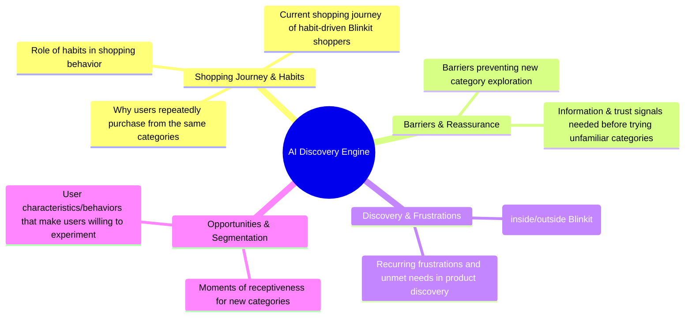

# Problem Statement: AI-Powered Discovery Engine for Habit-Driven Blinkit Shoppers

## 1. Executive Summary & Context
You must build an AI-powered system that analyzes user feedback at scale. The primary objective is to gain deep insights into shopping habits, frustrations, and discovery mechanisms across multiple channels.

> [!IMPORTANT]
> **Strategic Goal**
> Increase the percentage of Monthly Active Customers who purchase products from at least one new category every month.
> 
> *Target User Segment:* Habit-Driven Shoppers

---

## 2. Core Problem Statement
> **How do habit-driven Blinkit shoppers make purchase decisions, what keeps them returning to familiar product categories, and what motivates them to explore and purchase from new categories?**

---

## 3. Data Sources for Scale Analysis
To support this discovery, the AI-powered system will analyze feedback and discussions across:
* **App Store & Play Store reviews**
* **Reddit discussions**
* **Community forums**
* **Social media conversations**
* **Product reviews**
* **Quick-commerce discussions**

---

## 4. Key Research Questions & Engine Objectives

The AI Discovery Engine aims to investigate the following core themes:

### 📋 Detailed Objectives Checklist

#### A. Shopping Journey & Habit Dynamics
* [ ] **Understand the Journey:** Map the current shopping journey of habit-driven Blinkit shoppers and how they make purchase decisions.
* [ ] **Habit Persistence:** Identify why users repeatedly purchase from the same product categories and how shopping habits influence their behavior.
* [ ] **Role of Habit:** Analyze the broader role that habits play in overall shopping behavior.

#### B. Exploration Barriers & Reassurance
* [ ] **Identify Barriers:** Pinpoint the specific barriers that prevent users from exploring and purchasing products from new categories.
* [ ] **Trust & Reassurance:** Understand the specific information, trust signals, or reassurance users need before trying a product from an unfamiliar category.

#### C. Discovery Mechanisms & Frustrations
* [ ] **Current Discovery:** Track how users currently discover new products or categories, both within and outside the Blinkit platform.
* [ ] **Pain Points:** Discover recurring frustrations and unmet needs related to product discovery and category exploration.

#### D. User Receptivity & Segmentation
* [ ] **Experimental Segments:** Identify which user characteristics or shopping behaviors make some users more willing to experiment than others.
* [ ] **Key Touchpoints:** Identify the moments in the shopping journey where users are most receptive to discovering and purchasing products from new categories.
