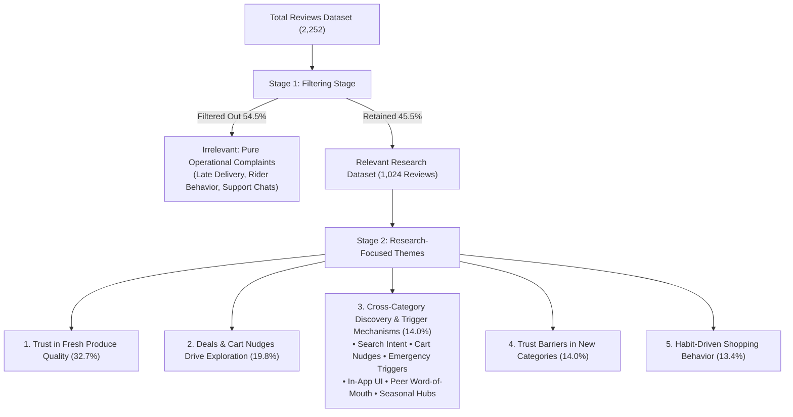

# Research-Focused Thematic Analysis & Filtering Report

This report presents a **two-stage thematic analysis** across **2,252 user comments and reviews** collected from 5 datasets:
*   [blinkit_reviews_2000.json](file:///c:/Graduation%20Project/blinkit_reviews_2000.json) (2,000 Play Store reviews)
*   [mouthshut_reviews.json](file:///c:/Graduation%20Project/mouthshut_reviews.json) (80 MouthShut reviews)
*   [blinkit_scrape_1.json](file:///c:/Graduation%20Project/blinkit_scrape_1.json) (37 items including brand strategy & discussion threads)
*   [blinkit_scrape_2.json](file:///c:/Graduation%20Project/blinkit_scrape_2.json) (130 quick commerce community comments)
*   [reddit_reviews.json](file:///c:/Graduation%20Project/reddit_reviews.json) (8 Reddit Q&A reviews)

---

## Stage 1: Data Filtering Pipeline

To align with the research objectives of understanding **shopping behavior, cross-category discovery, product trust, and purchase decision-making**, all 2,252 reviews were first passed through a filtering classification stage.

### Classification Rules:

*   **Relevant (Retained):** Reviews discussing shopping habits, reordering patterns, category discovery (electronics, beauty, pet supplies, festive items), product trust/risk, pricing sensitivity, free-delivery threshold nudges, or quality perceptions.
    *   *Examples:* *"I always reorder the same basket."*, *"Didn't know Blinkit sold pet supplies."*, *"I don't trust buying skincare here."*, *"I only buy new things when they're discounted."*
*   **Irrelevant (Filtered Out):** Reviews focused exclusively on pure operational complaints (delivery speed/delays, rider behavior, refund processing time, or chatbot technical disconnections).
    *   *Examples:* *"Delivery was late."*, *"Delivery partner was rude."*, *"Refund not received."*, *"Chatbot disconnected."*

### Stage 1 Filtering Results:

| Metric | Count | Percentage (%) |
| :--- | :---: | :---: |
| **Total Evaluated Dataset** | **2,252** | **100.0%** |
| **Irrelevant Operational Reviews (Filtered Out)** | **1,228** | **54.5%** |
| **Relevant Research Dataset (Retained)** | **1,024** | **45.5%** |

#### Dataset Source Breakdown:
*   `blinkit_reviews_2000.json`: 890 Relevant (44.5%) \| 1,110 Irrelevant (55.5%)
*   `mouthshut_reviews.json`: 50 Relevant (62.5%) \| 30 Irrelevant (37.5%)
*   `blinkit_scrape_2.json`: 53 Relevant (40.8%) \| 77 Irrelevant (59.2%)
*   `blinkit_scrape_1.json`: 28 Relevant (75.7%) \| 9 Irrelevant (24.3%)
*   `reddit_reviews.json`: 3 Relevant (60.0%) \| 2 Irrelevant (40.0%)

---

## Stage 2: Research-Focused Thematic Analysis

Re-analysis of the **1,024 relevant reviews** yielded **5 distinct recurring themes** focused on shopping behavior, category discovery, product trust, and decision-making mechanics.

| Theme Label | Mentions (in Relevant Subset) | Share (%) | Core Focus Area |
| :--- | :---: | :---: | :--- |
| **1. Trust in Fresh Produce Quality** | 335 | 32.7% | App selection of fresh produce vs. handpicking in stores; unapproved substitutions. |
| **2. Deals & Cart Nudges Drive Exploration** | 203 | 19.8% | Gamified thresholds (*"Add ₹40 for Free Delivery"*), BOGO, flash sales, impulse buying. |
| **3. Cross-Category Discovery & Trigger Mechanisms** | 143 | 14.0% | What categories are discovered (electronics, beauty, pet supplies) and HOW (6 discovery pathways). |
| **4. Trust Barriers in New Categories** | 143 | 14.0% | Perceived risk & hesitation when buying high-value electronics/skincare vs. low-risk groceries. |
| **5. Habit-Driven Shopping Behavior** | 137 | 13.4% | Habitual repeat ordering, list adherence, on-demand vs. planned grocery stocking. |

---

## Detailed Theme Analysis

### Theme 1: Trust in Fresh Produce Quality
> **Prevalence:** 335 mentions (32.7% of relevant dataset)  
> **Key Insight:** Customers exhibit high vulnerability and scrutiny when delegating fresh produce selection to quick commerce pickers.

#### Pattern Analysis:
Users report a sharp division in trust between packaged goods and fresh produce (fruits, vegetables, dairy). While packaged items are predictable, fresh produce relies on picker judgment. Bad experiences (rotten tomatoes, wilted greens, near-expiry milk) weaken category trust. Additionally, automated item substitutions (e.g., substituting mint for coriander without notice) create strong consumer friction.

#### Representative Quotes:
> *"I don't use those. I like to pick out my own groceries, particularly anything perishable... I still don't trust the store's judgment on my produce."* — [blinkit_scrape_1.json](file:///c:/Graduation%20Project/blinkit_scrape_1.json)  
> *"Some of the vegetable substitutions when items are out of stock don't even make sense — ordered coriander, got mint instead, no heads up given."* — [blinkit_scrape_2.json](file:///c:/Graduation%20Project/blinkit_scrape_2.json)

---

### Theme 2: Deals & Cart Nudges Drive Exploration
> **Prevalence:** 203 mentions (19.8% of relevant dataset)  
> **Key Insight:** Free-delivery thresholds and gamified discounts act as powerful psychological nudges that drive impulse additions and cart expansion.

#### Pattern Analysis:
Consumers actively optimize cart totals to hit free delivery thresholds (e.g., *"Add ₹50 more for free delivery"*). This prompt frequently triggers impulse purchases of snacks, ice cream, or non-essential items. Flash discounts, BOGO offers, and combo packs keep users browsing apps longer, leading many to question whether they saved money or simply spent more on unneeded products.

#### Key Sub-Themes:
*   **Threshold-Driven Cart Padding:** Adding extra items solely to unlock free shipping.
*   **Offer-Hunting & Impulse Overspending:** Browsing deals leading to spontaneous cart expansion.
*   **Cross-App Price Comparison:** Switching between Swiggy Instamart, Zepto, and Blinkit to hunt best offers.

#### Representative Quotes:
> *"I open apps to buy a few things and somehow end up adding extra items because of 'Add more for free delivery', combo offers, and cashback offers... In the end I'm not sure whether I saved money or just bought unnecessary stuff."* — [blinkit_scrape_1.json](file:///c:/Graduation%20Project/blinkit_scrape_1.json)  
> *"Since 2 ice creams don't reach free delivery mark, I order one more and give it to the first construction worker I see."* — [blinkit_scrape_1.json](file:///c:/Graduation%20Project/blinkit_scrape_1.json)

---

### Theme 3: Cross-Category Discovery & Trigger Mechanisms
> **Prevalence:** 143 mentions (14.0% of relevant dataset)  
> **Key Insight:** Quick commerce is transitioning into a general instant marketplace. Discovery of non-grocery categories occurs through 6 distinct behavioral & UI triggers.

#### What Consumers Discover:
Surprise at discovering non-grocery items—such as pet supplies, festival diyas/flowers, small electronics (chargers, kettles, earphones), cosmetics/skincare, toys, or instant document printouts—available for 10-minute delivery.

#### How Consumers Discover (The 6 Discovery Pathways & MVP Implications):

| Discovery Pathway | Evidence Count | Mechanism Description | MVP Design Implication |
| :--- | :---: | :--- | :--- |
| **1. Emergency / Urgent Need** | 115 mentions | Sudden, unexpected necessity (2am baby diapers, first-aid, phone chargers, admit card printouts). | Add an **"Emergency Essentials"** quick-filter widget on the homepage. |
| **2. Cart Threshold & Deal Nudges** | 105 mentions | Adding non-grocery add-ons to reach free-delivery thresholds (*"Add ₹45 for Free Shipping"*). | Implement **Smart Cart Fillers** suggesting relevant non-grocery products near threshold gaps. |
| **3. In-App UI & Merchandising** | 65 mentions | Browsing clean category grids, homepage banners, or auto-curated carousels. | Optimize **Category Tiles** & visual hierarchy for non-grocery browsing. |
| **4. Search-Driven Intent Queries** | 34 mentions | Active keyword queries typed into the search bar (e.g., *"CeraVe"*, *"kettle"*, *"boAt"*). | Enhance **Search Auto-Suggest** with instant cross-category recommendations. |
| **5. Word-of-Mouth & Peer Triggers** | 32 mentions | Recommendations from friends, family, or delivery rider prompts. | Enable **Social Shareables** & "Send a Gift / Item" features. |
| **6. Seasonal & Event Campaigns** | 7 mentions | Holiday hubs (Diwali sparklers/diyas, Rose Day bouquets, monsoon gear). | Deploy **Dynamic Seasonal Banners** tied to real-time events. |

#### Representative Quotes:
> *"Ran out of diapers at 2am with a screaming baby and Blinkit saved the day... Being able to order first-aid supplies immediately."* — [blinkit_scrape_2.json](file:///c:/Graduation%20Project/blinkit_scrape_2.json)  
> *"Blinkit's festival stock during Diwali was insane — got sparklers, sweets, and diyas all in one order without stepping out into traffic."* — [blinkit_scrape_2.json](file:///c:/Graduation%20Project/blinkit_scrape_2.json)  
> *"The Blinkit app UI is so clean compared to Instamart. I can find what I want in two taps instead of scrolling through fifteen banners."* — [blinkit_scrape_2.json](file:///c:/Graduation%20Project/blinkit_scrape_2.json)

---

### Theme 4: Trust Barriers in New Categories
> **Prevalence:** 143 mentions (14.0% of relevant dataset)  
> **Key Insight:** Higher price points and non-returnable categories (electronics, cosmetics, appliances) face a steep perceived risk barrier compared to low-cost groceries.

#### Pattern Analysis:
When expanding into high-value categories (e.g., CeraVe skincare, boAt earphones, air fryers), consumer trust drops significantly due to strict "No Return / Contact Manufacturer" policies. Users express high anxiety over receiving counterfeit products, damaged seals, or unhandled warranty claims. This creates a clear boundary: low-risk items (milk, bread) are bought freely, while high-risk categories face strong purchase hesitation.

#### Key Sub-Themes:
*   **High-Value Category Anxiety:** Fear of buying expensive electronics or skincare due to lack of return options.
*   **Authenticity & Counterfeit Concerns:** Doubts regarding original vs. duplicate cosmetics/skincare.
*   **Return Policy Hesitation:** Strict return policies deterring users from buying appliances or non-staples.

#### Representative Quotes:
> *"I was thinking of buying CeraVe product from Blinkit since I was excited to get it quickly... But can they sell fake beauty products? Should I buy CeraVe cream from Blinkit or not?"* — [blinkit_scrape_1.json](file:///c:/Graduation%20Project/blinkit_scrape_1.json)  
> *"Ordered a boAt Airdopes Elite... When I raised the issue, delivery personnel insisted I accept damaged package. Refused both return and exchange."* — [mouthshut_reviews.json](file:///c:/Graduation%20Project/mouthshut_reviews.json)

---

### Theme 5: Habit-Driven Shopping Behavior
> **Prevalence:** 137 mentions (13.4% of relevant dataset)  
> **Key Insight:** Quick commerce has split consumer shopping into two distinct modes: habitual strict reordering vs. spontaneous impulse buying.

#### Pattern Analysis:
This theme highlights how users construct their shopping baskets. One segment of consumers maintains strict weekly grocery lists (reordering identical baskets of 10–15 staple items), using quick commerce purely as a utility. Another segment has completely abandoned weekly grocery planning, buying items strictly on-demand as immediate needs arise.

#### Key Sub-Themes:
*   **Habitual Repeat Reordering:** Sticking strictly to saved lists/previous orders to avoid impulse traps.
*   **On-Demand Replenishment:** Buying items only when depleted rather than maintaining household stock.
*   **Utility vs. Experiential Browsing:** Pure functional purchasing vs. casual app browsing.

#### Representative Quotes:
> *"I have a very strict weekly grocery list consisting of 10-15 items max. I just order them repetitively mostly so I don't consider buying anything extra... Sticking to a list always helps."* — [blinkit_scrape_1.json](file:///c:/Graduation%20Project/blinkit_scrape_1.json)  
> *"Ordered milk and bread at 11pm because I forgot to stock up... Blinkit has genuinely changed how I plan my week — I don't stock up anymore, I just order as needed."* — [blinkit_scrape_2.json](file:///c:/Graduation%20Project/blinkit_scrape_2.json)

---

## Strategic Synthesis Diagram

> [!IMPORTANT]
> **MVP Design Takeaway:** To drive cross-category adoption beyond groceries, the MVP must leverage the **6 Discovery Pathways** (particularly *Emergency Triggers* and *Smart Cart Threshold Fillers*) while addressing **Trust Barriers in New Categories (14.0%)** through transparent warranty badges and unboxing verification.
